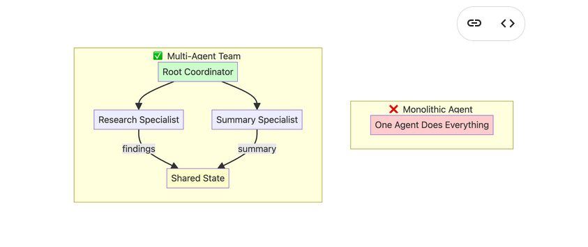
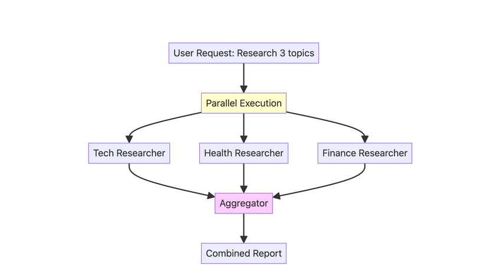

<h1 id="top">Day 1: Introduction to AI Agents</h1>


### 📘 Table of Contents

- **From Prompt to Action: Monolithic Agent**
-  **Multi-Agent Systems & Workflow Patterns**
-  **Key Takeaways**
-  **Important Links**


---

# Part - 1. From Prompt to Action

## 1. What is an AI Agent?
- **Traditional LLM:** `Prompt -> LLM -> Text`
- **AI Agent:** `Prompt -> Agent -> Thought -> Action -> Observation -> Final Answer`

>An agent goes beyond simple text responses - it can take actions(like searching Google) to find information and accomplish tasks.

## 2. Core ADK Components

1. **Agent** - The main building block
   - `name`: Identifier for the agent
   - `description`: What the agent does
   - `model`: LLM to use (e.g., "gemini-2.5-flash-lite")
   - `instruction`: The agent's guiding prompt/behavior
   - `tools`: List of tools the agent can use (e.g., google_search)

2. **Runner** - Orchestrates agent execution
   - `InMemoryRunner`: Manages conversation and agent responses
   - `.run_debug()`: Quick method for prototyping (abstracts session creation)

3. **Tools** - Actions the agent can perform
   - `google_search`: Built-in tool for web searches
   - `FunctionTool`: Wrapper for custom Python functions
   - `AgentTool`: Wrapper to make sub-agents callable as tools

## 3. Key Setup Steps
```python
from google.adk.agents import Agent
from google.adk.runners import InMemoryRunner
from google.adk.tools import google_search

root_agent = Agent(
    name="helpful_assistant",
    model="gemini-2.5-flash-lite",
    instruction="You are a helpful assistant...",
    tools=[google_search]
)

runner = InMemoryRunner(agent=root_agent)
response = await runner.run_debug("Your question here")
```

## 4. ADK Web Interface
- Built-in UI for testing and debugging agents
- Created with `adk create` command
- Launched with `adk web` command
- Great for visualizing agent's thought process and tool usage

<br>

[↑ Back to top](#top)

---


# Part - 2. Multi-Agent Systems & Workflow Patterns

## 1. Why Multi-Agent Systems?

- **Problem with Monolithic Agents:**
    - iInstruction prompt gets long and confusing
    - Hard to debug (which part failed?)
    - Difficult to maintain
    - produces unreliable results

- **Multi-Agent Solution:**
    - Team of simple, specialized agents
    - Each agent has one clear job
    - Easier to build, test, and maintain
    - More reliable through collaboration

## 2. Architecture: Single Agent vs Multi-Agent Team




## 3. Example: Research & Summarization System
Let's build a system with two specialized agents:
- **Research Agent** - Searches for information using Google Search
- **Summarizer Agent** - Creates concise summaries from research findings

```python
research_agent = Agent(
    name="ResearchAgent",
    model="gemini-2.5-flash-lite",
    instruction="...",
    tools=[google_search],
    output_key="research_findings" # The result of this agent will be stored in the session state with this key.
)

summarizer_agent = Agent(
    name="SummarizerAgent",
    model="gemini-2.5-flash-lite",
    instruction="Summarize: {research_findings}",  # References previous output
    output_key="final_summary"
)
```

[↑ Back to top](#top)

## 4.  Four Workflow Patterns


### 4.1 Sequential Workflows - The Assembly Line
- **When to use:** Order matters, need predictable pipeline
- **How it works:** Runs agents in exact order listed
- **Pattern:** A -> B -> C (each waits for previous)

>The output of one agent automatically becomes the input for the next, creating a predictable and reliable workflow.

#### Architecture: Blog Post Creation Pipeline


```python
root_agent = SequentialAgent(
    name="Pipeline",
    sub_agents=[outline_agent, writer_agent, editor_agent]
)
```

>To learn more, check out the documentation related to  [Sequential Agents](https://google.github.io/adk-docs/agents/workflow-agents/sequential-agents/)

### 4.2 Parallel Workflows -Concurrent Execution

- **When to use:** Independent tasks that can run simultaneously
- **How it works:** All sub-agents run at once, results combined after
- **Benefit:** Dramatically speeds up workflow

#### Architecture: Multi-Topic Research



```python
# The ParallelAgent runs all its sub-agents simultaneously.
parallel_research_team = ParallelAgent(
    name="ParallelResearchTeam",
    sub_agents=[tech_researcher, health_researcher, finance_researcher],
)

# Often combined with Sequential for aggregation
root_agent = SequentialAgent(
    name="ResearchSystem",
    sub_agents=[parallel_research_team, aggregator_agent],
)
```

>To learn more, check out the documentation related to [Parallel Agents](https://google.github.io/adk-docs/agents/workflow-agents/parallel-agents/)

### 4.3  Loop Workflow (Iterative Refinement)
- **When to use:** Need quality improvement through feedback cycles
- **How it works:** Repeats agents until condition met or max iterations is  reached
- **Key:** Needs exit condition (e.g., calling `exit_loop` function)


#### Architecture: Story Writing & Critique Loop


```python
def exit_loop():
    """Called when refinement is complete"""
    return {"status": "approved"}

critic_agent = Agent(name="Critic", ...)
refiner_agent = Agent(
    name="Refiner",
    instruction="If critique is APPROVED, call exit_loop. Otherwise, improve.",
    tools=[FunctionTool(exit_loop)]
)

loop = LoopAgent(
    sub_agents=[critic_agent, refiner_agent],
    max_iterations=3
)
```
>To learn more, check out the documentation related to [Loop Agents](https://google.github.io/adk-docs/agents/workflow-agents/loop-agents/)

### 4.4  LLM-Based Orchestration (Dynamic)
- **When to use:** Need flexible, dynamic decision-making
-  **How it works:** Root agent has sub-agents as tools via `AgentTool`
- **Caveat:** Can be unpredictable - LLM decides the order

```python
root_agent = Agent(
    name="Coordinator",
    instruction="First call ResearchAgent, then SummarizerAgent",
    tools=[AgentTool(research_agent), AgentTool(summarizer_agent)]
)
```


## 5. Decision Tree: Choosing the Right Pattern

| Pattern | When to Use | Key Feature | Example |
|---------|-------------|-------------|---------|
| **LLM Orchestrator** | Dynamic decisions needed | LLM chooses what to call | Research + Summarize |
| **Sequential** | Order matters, linear pipeline | Deterministic order | Outline -> Write -> Edit |
| **Parallel** | Independent tasks, speed critical | Concurrent execution | Multi-topic research |
| **Loop** | Iterative improvement needed | Repeated refinement cycles | Writer + Critic |

### Combining Patterns
You can nest workflows for complex systems:
- Sequential containing Parallel (research in parallel, then aggregate)
- Sequential containing Loop (initial draft, then refinement loop)
- Mix and match as needed

---

## Key Takeaways

- **Agents vs LLMs:** Agents can take actions and observe results, not just generate text
- **Specialization wins:** Multiple simple agents > one complex agent
- **State management:** Use `output_key` to pass data between agents
- **Pattern selection matters:** Choose Sequential for order, Parallel for speed, Loop for quality
- **ADK is flexible:** Supports both dynamic (LLM-orchestrated) and deterministic (workflow agents) patterns

## Important Links


- [ADK Documentation](https://google.github.io/adk-docs/)
- [ADK Python Quickstart](https://google.github.io/adk-docs/get-started/python/)
- [ADK Agents Overview](https://google.github.io/adk-docs/agents/) 
- [Tools Overview](https://google.github.io/adk-docs/tools/)
- [Gemini API Docs](https://ai.google.dev/gemini-api/docs)
- [Get API Key](https://aistudio.google.com/app/api-keys)


<br>

[↑ Back to top](#top)