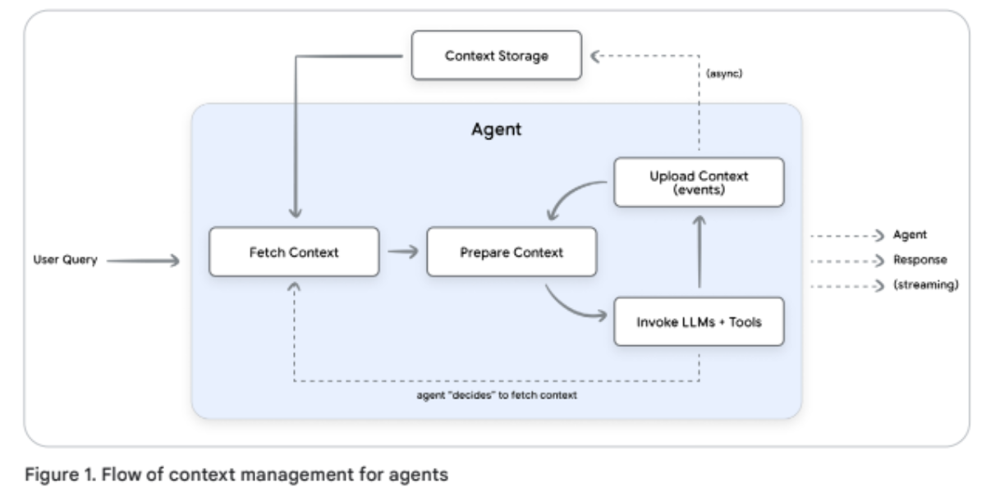

<h1 id="top"> Day 3 : Context Engineering: Sessions & Memory</h1>

---

# Part 1 : Session

> A user-specific container holding the full chronological conversation history, including tool interactions and responses, isolated per user and agent.

In ADK, a Session is comprised of two key components Events and State:

## 1. Events

> While a session is a container for conversations, Events are the building blocks of a conversation.

Example of Events:

- User Input: A message from the user (text, audio, image, etc.)
- Agent Response: The agent's reply to the user
- Tool Call: The agent's decision to use an external tool or API
- Tool Output: The data returned from a tool call, which the agent uses to continue its reasoning

## 2. State

> A temporary working memory holding structured data relevant to the ongoing conversation (e.g., shopping cart items).


Snippet 1: Example multi-turn call to Gemini

```python
contents = [
  {
  "role": "user",
  "parts": [ {"text": "What is the capital of France?"} ]},
  {
  "role": "model",
  "parts": [ {"text": "The capital of France is Paris."} ]
  }
]
response = client.models.generate_content(
model="gemini-2.5-flash",
contents=contents
)
```

## 3. Session handling in multi-agent systems

Agent frameworks handle session history for multi-agent systems using one of two primary approaches:

- **Shared history:** All agents contribute to one unified log.
- **Separate histories:** Each agent maintains its own view.
  Choice depends on task type and collaboration style.

## 4. Session management

To manage sessions and events, ADK offers :

- **SessionService (storage layer)**: Creates, stores, and retrieves session data using memory, database, or cloud storage.

- **Runner (orchestration layer)**: Manages user–agent communication flow, maintains conversation history, and handles context engineering automatically.

#### Think of it like this:

- Session = A notebook
- Events = Individual entries in a single page
- SessionService = The filing cabinet storing notebooks
- Runner = The assistant managing the conversation

<br>

[↑ Back to top](#top)

## 5. Persistent Sessions with `DatabaseSessionService`

While `InMemorySessionService` is great for prototyping, real-world applications need conversations to survive restarts, crashes, and deployments. Let's level up to persistent storage!

### 5.1 Choosing the Right SessionService

ADK provides different SessionService implementations for different needs:

| Service                    | Use Case              | Persistence       | Best For             |
| -------------------------- | --------------------- | ----------------- | -------------------- |
| **InMemorySessionService** | Development & Testing | Lost on restart   | Quick prototypes     |
| **DatabaseSessionService** | Self-managed apps     | Survives restarts | Small to medium apps |
| **Agent Engine Sessions**  | Production on GCP     | Fully managed     | Enterprise scale     |

## 6. Production Considerations for Sessions

The key considerationsfall into three critical areas:

- **Security & Privacy:** Enforce strict user isolation (e.g., ACLs) to prevent cross-access.
- **Data Integrity & Lifecycle:** Use TTL policies and maintain chronological order for reliable session logs.
- **Performance & Scalability:** Reduce data transfer by filtering or compacting outdated session history.

## 7. Session data reduction strategies

• **Last N turns:** Keep only the most recent N conversation turns and discard older ones.
• **Token-based truncation:** Retain recent messages up to a fixed token limit; drop the rest.
• **Recursive summarization:** Replace old messages with AI-generated summaries to preserve context in compact form.

## 8. Compaction triggers

• **Count-based:** Trigger when token or turn limits are exceeded.
• **Time-based:** Trigger after inactivity for a set duration.
• **Event-based:** Trigger when a task or topic is completed.

## 9. Summary

- **Context Engineering** - You understand how to assemble context for LLMs using Context Compaction
- **Sessions & Events** - You can maintain conversation history across multiple turns
- **Persistent Storage** - You know how to make conversations survive restarts
- **Session State** - You can track structured data during conversations
- **Manual State Management** - You've experienced both the power and limitations of manual approaches
- **Production Considerations** - You're ready to handle real-world challenges

<br>

[↑ Back to top](#top)

---

# Part 2 : Memory


>Memory is a service that provides long-term knowledge storage for an agents.

## 1. Context Management 

1. **User:** Provides raw data for memories.
2. **Agent (logic):** Decides what and when to remember, orchestrating memory retrieval and generation.
3. **Agent framework:** Connects logic to memory, manages context injection, not long-term storage.
4. **Session storage:** Stores raw conversation turns for memory extraction.
5. **Memory manager:** Handles full memory lifecycle—**extraction**, **consolidation**, **storage**, and **retrieval**.



## 2. Typs of Memory:

- **Content:** Extracted session data, structured (JSON/dictionary) or unstructured (natural language).
- **Metadata:** Context info like IDs, ownership, and labels describing the memory.

## 3. Type of Information

- **Declarative memory:** Knowledge of facts, events, or user-specific information (answers “what”).
- **Procedural memory:** Knowledge of skills or workflows guiding actions (answers “how”).

# 4. Memory Workflow

 In order to integrate Memory into  Agents, there are **three high-level steps.**
Three-step integration process:

1. **Initialize** → Create a `MemoryService` and provide it to  agent via the `Runner`
2. **Ingest** → Transfer session data to memory using `add_session_to_memory()`
3. **Retrieve** → Search stored memories using `search_memory()`


## 4.1. Initialize MemoryService
### 4.1.1 Initialize Memory
Use ADK’s `MemoryService` options —

* **InMemoryMemoryService:** For testing, no persistence.
* **VertexAiMemoryBankService:** Cloud-managed with LLM-based search.
* **Custom:** Database-based, for advanced use.

```python
memory_service = (
    InMemoryMemoryService()
)  # ADK's built-in Memory Service for development and testing
```

### 4.1.2 Add Memory to Agent

Next, create a simple agent to answer user queries.
```python
# Define constants used throughout the notebook
APP_NAME = "MemoryDemoApp"
USER_ID = "demo_user"

# Create agent
user_agent = LlmAgent(
    model=Gemini(model="gemini-2.5-flash-lite", retry_options=retry_config),
    name="MemoryDemoAgent",
    instruction="Answer user questions in simple words.",
)

print("✅ Agent created")
```
### 4.1.3 Create Runner

Now provide both Session and Memory services to the `Runner`.

**Key configuration:**

The `Runner` requires both services to enable memory functionality:
- **`session_service`** → Manages conversation threads and events
- **`memory_service`** → Provides long-term knowledge storage
```python
# Create Session Service
session_service = InMemorySessionService()  # Handles conversations

# Create runner with BOTH services
runner = Runner(
    agent=user_agent,
    app_name="MemoryDemoApp",
    session_service=session_service,
    memory_service=memory_service,  # Memory service is now available!
)

print("✅ Agent and Runner created with memory support!")
```

<br>

[↑ Back to top](#top)

## 4.2. Ingest Session Data into Memory

### Why transfer session data to memory ?
To enable long-term recall, session data (raw messages, tool calls, metadata) must be transferred to memory using `add_session_to_memory()`.
Managed services like **Vertex AI Memory Bank** extract key facts and remove noise, while **InMemoryMemoryService** simply stores all data for learning purposes.


## 4.3. Memory Retrieval in ADK

ADK provides two built-in tools for memory retrieval:

**`load_memory` (Reactive)**
- Agent decides when to search memory
- Only retrieves when the agent thinks it's needed
- More efficient (saves tokens)
- Risk: Agent might forget to search

**`preload_memory` (Proactive)**
- Automatically searches before every turn
- Memory always available to the agent
- Guaranteed context, but less efficient
- Searches even when not needed

```python
# Create agent
user_agent = LlmAgent(
    model=Gemini(model="gemini-2.5-flash-lite", retry_options=retry_config),
    name="MemoryDemoAgent",
    instruction="Answer user questions in simple words. Use load_memory tool if you need to recall past conversations.",
    tools=[
        load_memory
    ],  # Agent now has access to Memory and can search it whenever it decides to!
)

print("✅ Agent with load_memory tool created.")
```

# 5. Automating Memory Storage

### 5.1 Callback

Available callback types:

- `before_agent_callback` → Runs before agent starts processing a request
- `after_agent_callback` → Runs after agent completes its turn  
- `before_tool_callback` / `after_tool_callback` → Around tool invocations
- `before_model_callback` / `after_model_callback` → Around LLM calls
- `on_model_error_callback` → When errors occur


## 6. How often should  save Sessions to Memory?


| Timing | Implementation | Best For |
|--------|----------------|----------|
| **After every turn** | `after_agent_callback` | Real-time memory updates |
| **End of conversation** | Manual call when session ends | Batch processing, reduce API calls |
| **Periodic intervals** | Timer-based background job | Long-running conversations |


## 7. What is Memory Consolidation?

Extracting **only important facts** while discarding conversational noise.

**Before (Raw Storage):**

```
User: "My favorite color is BlueGreen. I also like purple. 
       Actually, I prefer BlueGreen most of the time."
Agent: "Great! I'll remember that."
User: "Thanks!"
Agent: "You're welcome!"

→ Stores ALL 4 messages (redundant, verbose)
```

**After (Consolidation):**

```
Extracted Memory: "User's favorite color: BlueGreen"

→ Stores 1 concise fact
```

**Benefits:** Less storage, faster retrieval, more accurate answers.


## 8.  Memory storage methods

- **Vector databases:** Store embeddings for semantic similarity searches, ideal for unstructured, natural language memories.
- **Knowledge graphs:** Store entities and relationships, enabling relational reasoning over structured data.
- **Hybrid approach:** Combines graphs with embeddings for both relational and semantic search.

## 9. Memory creation:

- **Explicit:** Directly commanded by the user to remember specific information.
- **Implicit:** Inferred by the agent from conversation without a direct command.

## 10. Memory scope:

- **User-level:** Tied to a user ID, persists across sessions for personalized experiences.
- **Session-level:** Limited to a single session, stores processed insights, not raw dialogue.
- **Application-level:** Shared across all users, for common knowledge or procedural guidance; must exclude sensitive data.

## 11. Memory generation process

Memory Generation: Extraction and Consolidation

1. **Ingestion:** Collect raw data (e.g., conversation history).
2. **Extraction & Filtering:** Use LLMs to capture only topic-relevant information.
3. **Consolidation:** Resolve conflicts, deduplicate, merge, delete, or create new memories.
4. **Storage:** Persist memories in durable storage (vector DB or knowledge graph) for future retrieval.

## 12. Memory extraction

- Extracts **meaningful information** (facts, preferences, goals) from conversation, ignoring noise.
- “Meaningful” is **agent-specific** and defined by purpose or use case.
- LLMs follow **guardrails, schemas, templates, or few-shot examples** to identify and structure relevant data.
- Supports **custom topics** to tailor extraction to domain-specific needs.

## 13. Memory generation triggers

- **Session completion:** Generate at the end of a session.
- **Turn cadence:** Generate after a set number of turns (e.g., every 5).
- **Real-time:** Generate after each turn.
- **Explicit command:** Triggered by user instruction (e.g., “Remember this”).

## 14. Memory retrieval

- Retrieves the most relevant memories for the current conversation.
- **Key criteria:**

  - **Relevance (semantic similarity):** Conceptual match to the query.
  - **Recency (time-based):** How recent the memory is.
  - **Importance (significance):** Criticality defined at generation.

- **Advanced strategies:**

  - **Blended scoring:** Combines relevance, recency, and importance.
  - **Query rewriting:** Refines ambiguous input for better search.
  - **Reranking:** LLM reorders top candidates for accuracy.
  - **Specialized retrievers:** Fine-tuned models for domain-specific searches.

- **Optimization:** Use caching for expensive or slow retrievals; high-quality memory generation reduces retrieval complexity and improves effectiveness.

# 15. Summary
1. **Adding Memory**
   - Initialize `MemoryService` alongside `SessionService`
   - Both services are provided to the `Runner`

2. **Storing Information**
   - `await memory_service.add_session_to_memory(session)`
   - Transfers session data to long-term storage
   - Can be automated with callbacks

3. **Searching Memory**
   - `await memory_service.search_memory(app_name, user_id, query)`
   - Returns relevant memories from past conversations

4. **Retrieving in Agents**
   - **Reactive:** `load_memory` tool (agent decides when to use memory)
   - **Proactive:** `preload_memory` tool (always loads memory into LLM's system instructions)

5. **Memory Consolidation**
   - Extracts key information from Session data
   - Provided by managed memory services such as Vertex AI Memory Bank

---

    Session = Short-term memory (single conversation)
    Memory = Long-term knowledge (across multiple conversations)
<br>

[↑ Back to top](#top)